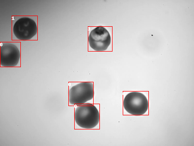
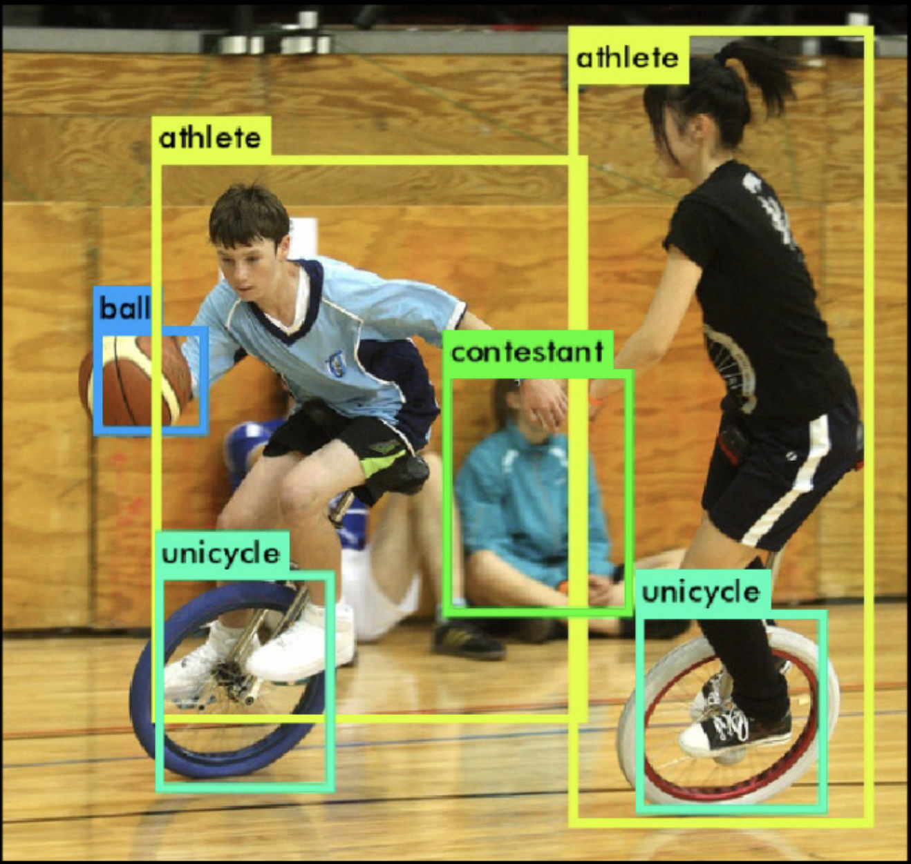

# You Only Glance Once (YOGO) Architecture

## Intro

Real-time object detection is a difficult challenge. In general, object detection requires significant compute requirements. The scale of these compute requirements vary depending on the specific architecture of the object detector. For example, deformable parts models (DPMs) scanned a classifier over an image at multiple scales. An improvement on this is the R-CNN family of models, which propose regions of the image that are then sent to the classifier, reducing the number of classification inferences required. These are "Two-Stage Detectors".

One-Stage Detectors, such as the YOLO family, Single Shot MultiBox Detector, and RetinaNet, produce their predictions in one forward pass of the network. They are generally faster than two-stage detectors with similar (or better) accuracy. Their speed makes them a natural choice for real-time object detection.

For our application of diagnosing malaria, we chose to work off of the YOLO family of networks, originally created py Joseph Redmon and Ali Farhadi (https://pjreddie.com/). The architecture of the YOGO network is a simplification of the YOLO networks (specifically YOLO versions 1-3) optimized for our application.

This document will discuss the YOGO architecture and how it is different from some of the YOLO architectures. First, though, we must understand the specifics of our problem (diagnosing malaria) compared to object detection datasets.

## On Diagnosing Malaria

Our specific application of diagnosing malaria is a much simpler problem (in terms of object detection) than typical object detection problems, due to the low number of classes and uniform sizes of all objects. Most object detectors are designed to perform well on large and varied datasets such as MS COCO, which has 80 classes with objects varying in size, shape, and position within the image.

For example, below is an image of malarial blood (100x magnification):

And here is an example of an image from the [YOLO9000 Paper](https://arxiv.org/pdf/1612.08242.pdf):

