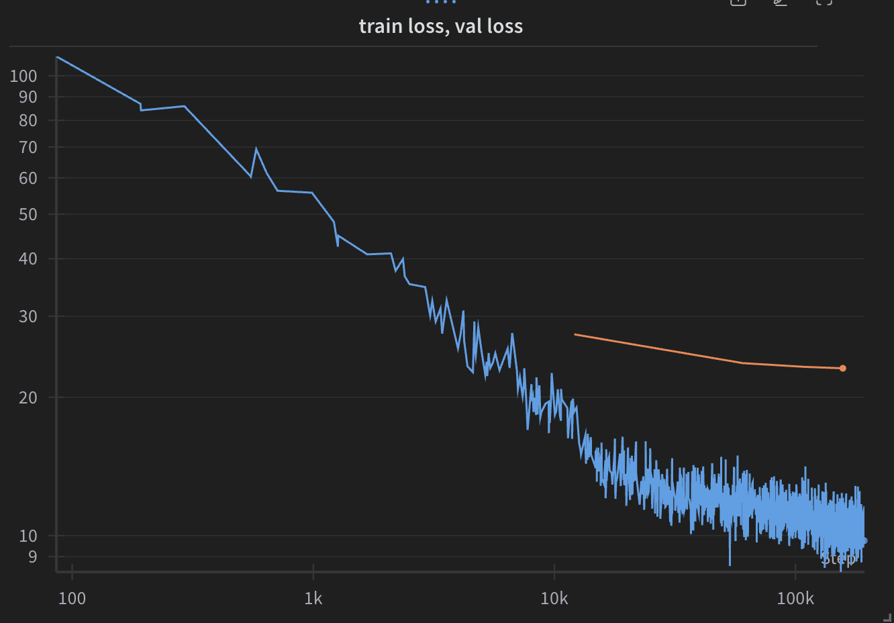

# Training

This document will cover the practical details of training YOGO - where to look for data, how to format your data, how to get a GPU, general tips, e.t.c. Pre-requisites are installing YOGO on Bruno.

Finally, look at the [cli guide](https://github.com/czbiohub-sf/yogo/blob/main/docs/cli.md#yogo-train) for brief instructions on `yogo train`.

## Dataset Definition

The `dataset_defn.yml` file provides data definitions, guiding the dataloader on splitting data for testing, validation, and training. A detailed explanation is in [dataset-definition.md](dataset-definition.md). The dataset definition files are in [this repo](https://github.com/czbiohub-sf/lfm-dataset-definitions?tab=readme-ov-file), which is in this location on bruno: ` .../LFM_scope/biohub-labels/dataset_defs`.

Training is split into pre-training and fine-tuning. Pre-training is first completed on YOGO-labelled data, and fine-tuning is completed on human-labelled data.

Here are dataset definition files:

- **Pre-training:** `pre-training/yogo_parasite_data_with_tests.yml`: Contains YOGO and hand-labelled test data.
- **Fine-tuning:** `fine-tuning/all-dataset-subsets.yml`: Only hand-labelled data.

## Accessing and Using GPUs

For efficient training, use a GPU by connecting to Bruno. The best way to learn how to use BRUNO is to look at [the Biohub's docs](https://hpc.czbiohub.org/) and to play around trying out training runs.

The general pattern is to use `sbatch` to submit the job, and `squeue --me` to check the status of your jobs. `sbatch` submits a script that will be run on Bruno. I've written scripts that you can `sbatch` which provision Bruno resources (such as GPUs, CPUs, e.t.c.). They are in the `yogo/scripts` directory:

- `submit_cmd.sh`: Asks for one GPU.
- `submit_cmd_multi_gpu_light.sh`: Asks for two GPUs.
- `submit_cmd_multi_gpu.sh`: Asks for four GPUs.

The multi-gpu scripts will train yogo much faster, but if Bruno is being heavily used, it may be difficult to get 4 gpus at once.

## W&B

We use [Weights and Biases](https://wandb.ai/) to track training runs. We'll need to add a seat or two to our account (https://wandb.ai/bioengineering).

## Training

Here, I'll show several examples of training runs. We'll assume you've already `cd`d into `yogo`. It'd also be good to brush up on the `yogo train` section of the [cli guide](https://github.com/czbiohub-sf/yogo/blob/main/docs/cli.md#yogo-train).

For a quick prelim, we'll set `DDF_PATHS` to the location of the dataset definition files. It is not necessary to do this, but it is useful for this guide to save space. In practice, I didn't do this.

```bash
$ export DDF_PATHS="/hpc/projects/group.bioengineering/LFM_scope/biohub-labels/dataset_defs/"
```

## Pre-training

The default hyperparameters are good for most training. We tend to change them a little bit depending on the goal of the training run. Here is a training run w/ the default hyperparameters.

```bash
$ sbatch scripts/submit_cmd_multi_gpu.sh yogo train "$DDF_PATHS/pre-training/yogo_parasite_data_with_tests.yml"
```

Though our pre-training dataset is quite large so we can train on fewer epochs - plus our validation loss diverges from training loss fairly quickly:

```bash
$ sbatch scripts/submit_cmd_multi_gpu.sh yogo train "$DDF_PATHS/pre-training/yogo_parasite_data_with_tests.yml" --epochs 16 --lr 0.0005 --normalize-images
```

<figure class="image" align="center">
  
  <figcaption><i>training loss for pre-training, showing divergence of validation loss (orange)</i></figcaption>
</figure>


A couple notes:

- Model weights are initialized from random weights
- `--lr` is the learning rate - default is 3e-4, but increasing it a little to 5e-4 seemed to do well for pre-training.
- `--epochs` is the number of times that we train over the data.
- `--normalize-images` is a flag to normalize images into the range `[0,1]` before being fed to YOGO. Good for stabilization during training, and it's a very common practice for image data. At export time, [we add a layer to normalize images if needed](https://github.com/czbiohub-sf/yogo/blob/37e4f5f363b10253418b613c3e76fc65b8b0a90c/yogo/utils/export_model.py#L30-L48) so `ulc-malaria-scope` is none-the-wiser.

This will create a `trained_models` directory in YOGO directory, and put your model there. The model name is created by W&B, and you should see some text in stdout stating what it is. The model checkpoints will be in `trained_models` - so if W&B's RNG chooses `chaos-cat-0727`, the checkpoints (`best.pth` and `last.pth`) will be in `trained_models/chaos-cat-0727`. We use these for fine-tuning.


## Fine-tuning

More training! Again, the defaults are good for most training. Here is a training run w/ the default hyperparameters.

```bash
$ sbatch scripts/submit_cmd_multi_gpu.sh yogo train "$DDF_PATHS/fine-tuning/all-dataset-subsets.yml" \
    --from-pretrained trained_models/chaos-cat-0727/best.pth
```

The `--from-pretrained` flag tells YOGO to start training from the model in `trained_models/chaos-cat-0727/best.pth`. Some notes:

- if `--normalize-images`, `--rgb-images`, or `--model` were used for pre-training, those options pass forward to fine-tuning - therefore you don't have to set them again, they'll just be ignored

By tuning hyperparameters, we can do better. Here's the hyperparameters for `still-voice-4405`:

```bash
$ sbatch scripts/submit_cmd_multi_gpu.sh yogo train ../dataset_defs/human-labels/all-dataset-subsets.yml \
    --epochs 256 --iou-weight 1 --classify-weight 10 --label-smoothing 0.0005 --learning-rate 3e-4 \
    --lr-decay-factor 3 --from-pretrained trained_models/earthy-elevator-1890/best.pth \
    --weight-decay 0.0001930025077473428
```

- A large number of epochs helps
- iou-weight and classify-weight are important hyperparameters. They weight the importance of IOU loss and classification loss, with a higher number meaning that errors are penalized more.
- [label smoothing](https://pytorch.org/docs/stable/generated/torch.nn.CrossEntropyLoss.html) (some potentially interesting papers: https://arxiv.org/pdf/1906.02629, https://arxiv.org/pdf/2011.12562)
- `--lr-decay-factor` - we decay our learning rate by a cosine function, and this defines how low the function goes. See [CosineAnnealingLR](https://pytorch.org/docs/stable/generated/torch.optim.lr_scheduler.CosineAnnealingLR.html)
- `--weight-decay` - see [AdamW](https://pytorch.org/docs/stable/generated/torch.optim.AdamW.html)
