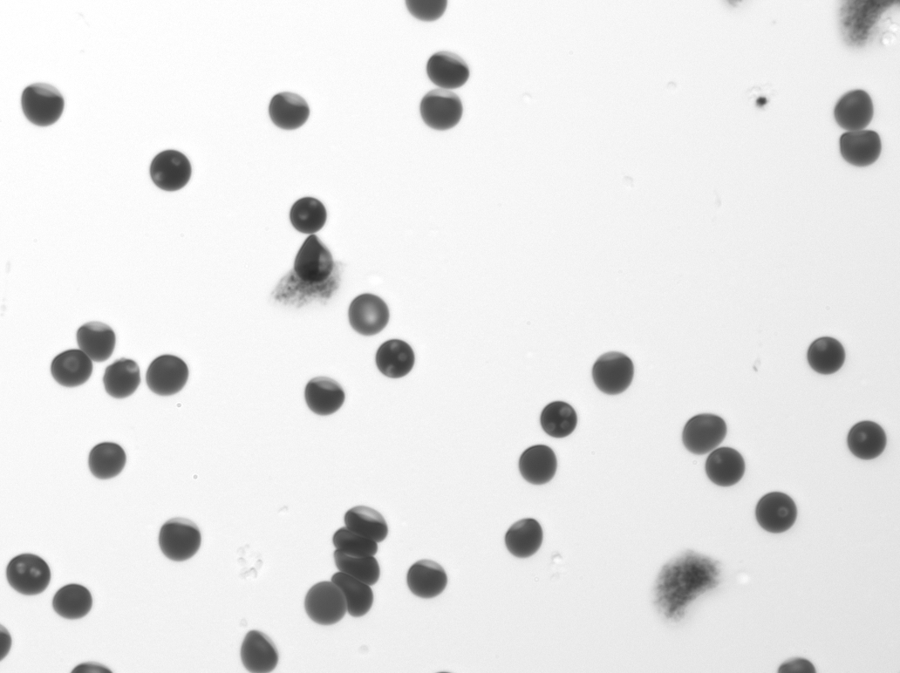
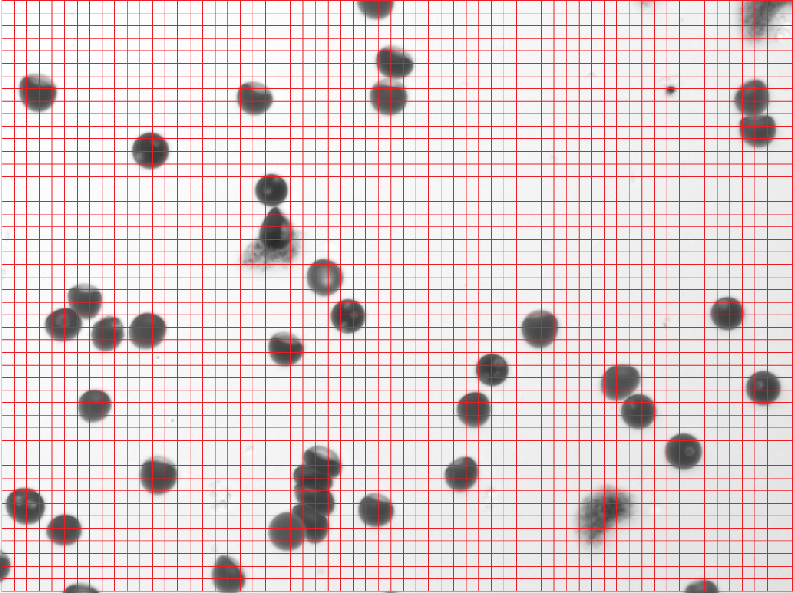
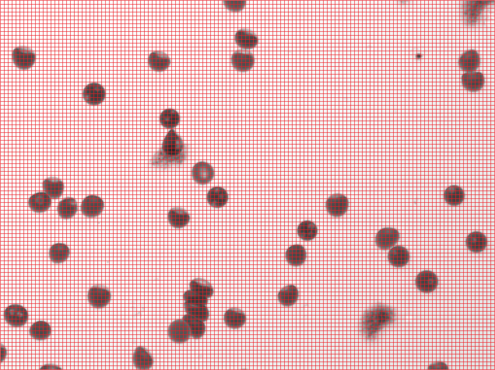

# You Only Glance Once (YOGO) Architecture

## Intro

Real-time object detection is a difficult challenge. In general, object detection requires significant compute requirements. The scale of these compute requirements vary depending on the specific architecture of the object detector. For example, deformable parts models (DPMs) scanned a classifier over an image at multiple scales. An improvement on this is the R-CNN family of models, which propose regions of the image that are then sent to the classifier, reducing the number of classification inferences required. These are "Two-Stage Detectors".

One-Stage Detectors, such as the YOLO family, Single Shot MultiBox Detector, and RetinaNet, produce their predictions in one forward pass of the network. They are generally faster than two-stage detectors with similar (or better) accuracy. Their speed makes them a natural choice for real-time object detection.

For our application of diagnosing malaria, we chose to work off of the YOLO family of networks, originally created py Joseph Redmon and Ali Farhadi (https://pjreddie.com/). The architecture of the YOGO network is a simplification of the YOLO networks (specifically YOLO versions 1-3) optimized for our application.

This document will discuss the YOGO architecture in increasing scales of complexity. First, though, we must understand the specifics of our problem (diagnosing malaria) compared to object detection datasets.

## On Diagnosing Malaria

YOGO was developed to detect malaria parasites in blood, in realtime, on limited hardware. Our specific application is simpler than typical object detection problems, due to the *low number of classes* and *uniform sizes of all objects*. Most object detectors are designed to perform well on large and varied datasets such as MS COCO, which has 80 classes with objects varying in size, shape, and position within the image.

In contrast, our original application deals with only seven object classes and a uniform (white) background. The following is a label-free image from the remoscope of cultured plasmodium falciparum:

*(A lot of features in this image: blood cells, platlets, toner blobs, and a stuck cell! Also, some ring parasites)*

And here is an example of an image from the [YOLO9000 Paper](https://arxiv.org/pdf/1612.08242.pdf) (not necessarily in the MS COCO dataset):

Notice the varying sizes of scale for people and the large number of classes - there are "athletes", "contestants", and "unicycles" in this picture. A typical, smaller dataset would have just classified "athletes" and "contestants" as "people".

The relative simplicity of our problem allows us to strip back a lot of the complexity of a typical YOLO architecture.

## YOGO Architecture - Various Levels of Complexity

### Level 1 - High Level

The YOGO architecture is a fairly vanilla convolutional neural network (CNN). It has convolutional layers with batch norm layers for normalization, and a little bit of clever shaping to get final result tensor in the shape that we want.

### Level 2 - Network Structure

See the [model file](../yogo/model.py) for reference from here on.

There are many little variations of the model, (see [`model_defns.py`](../yogo/model_defns.py) for more more architectures), but they all have a similar structure: a "backbone", which are all of the convolutional layers *except* for the final layer, and the "head", which is the final layer[^1].

You can imagine[^2] that the job of the backbone is to get the input image(s) into an abstract representation of the image (i.e. cells and their locations, cell types, e.t.c.), and the head is to turn the representation into a concrete prediction - specifically, a grid of "cells" that represent rectangular areas on the original image. Each of these "cells" predict whether or not there is a center of an object in that cell, along with the (potential) object bounding box and classification. The grid, and the values per grid-cell is our prediction tensor.

### Level 3 - The Prediction Tensor

The output for an image is a 4D tensor of shape $(batch~size,~prediction~dimension,~S_x,~S_y)$. The dimensions $S_x$ and $S_y$ are the width and height of the grid of cells, which will be discussed next. The "batch size" is the number of images that you are inferring at once, and is not very important for understanding YOGO, but it should be noted. The "prediction dimension" will be discussed after the grid.

#### **Grid of cells**

Before anything else, we must make the "grid of cells" concept concrete. To downsize the image / [feature map](https://stats.stackexchange.com/questions/291820/what-is-the-definition-of-a-feature-map-aka-activation-map-in-a-convolutio), we use convolutions with a stride of 2 - this will effectively halve the height and width of the feature map each time. We do this enough times, and we end up with a tensor of width ~= 127, and a height ~= 95 (depending on the model architecture). Keep in mind that this grid is a feature map that is a result of many convolutions. Each cell has "information" from many surrounding cells, due to the convolutions and down samplings.

Each cell is responsible for making a prediction if an *object's center is in that grid cell*. For example, the blood from above would have a final grid representation similar to this[^3]:

In practice, several grid cells may make predictions for the same object. It is common to use an algorithm like [Non-Maximal Supression](https://pytorch.org/vision/main/generated/torchvision.ops.nms.html) to choose the best box.

#### **Prediction Dimension**

The prediction dimension has a size of 4 + 1 + (the number of classes). The "4" is from the bounding box prediction, the "1" is the "objectness" of the cell of a bounding box, and the number of classes is self explanatory.

For the bounding box prediction, we predict the center of the box ($x_c$ and $y_c$), the width of the box $w$, and the height of the box $h$. The "objectness" is the probability that there is an object center in that cell - 0 if there is no object, and 1 if there is. The "classes" prediction is the probability mass function across classes, achieved with [softmax](https://developers.google.com/machine-learning/crash-course/multi-class-neural-networks/softmax).

## Conclusion: Next Steps for Understanding the Code

Reading the code is the best method.

- The [loss function](../yogo/yogo_loss.py) is arguably the most important part of the project, as it is what *gives meaning to the network's output*.
- The [training loop](../yogo/train.py) is pretty much just boiler plate, and is a bit ugly, but it is useful to read nonetheless.
- The `ObjectDetectionDataset` [class](../yogo/data/yogo_dataset.py) and [data loader](../yogo/data/yogo_dataloader.py) have the code to format the labels into something that we can use in training. It could also be cleaned up, but it is not too bad, and may be helpful for understanding YOGO.

## Great related sources

- [YOLO](https://arxiv.org/abs/1506.02640), [YOLO 9000](https://arxiv.org/abs/1612.08242), and [YOLOv3](https://arxiv.org/abs/1804.02767) are the seminal papers written primarily by Joseph Redmon and Ali Farhadi, and they should be considered **required reading** to understand YOLO / YOGO. They are very well written!
- [This is a great explanation of YOLO](https://www.jeremyjordan.me/object-detection-one-stage/). It will be good for comparing / contrasting with YOGO, and will have some supplemental specifics

## Footnotes

[^1]: Note that these terms are not rigorous, and expect them to have slightly different meanings when reading other deep learning literature

[^2]: Interpretability of neural networks is still a very young field, and in general, we don't have a good idea of how exactly they work as they do, so use this only as a flawed mental model.

[^3]: Notice how much finer the grid cells are compared to the blood cells. In fact, the grid that we use is actually way finer! The "fineness" of the grid, the relatively large size of blood cells, and the assumption that blood cells are not stacked on-top of eachother allows us to make the major simplifications that make YOGO different from YOLO. Also note that the size of the grid is another hyperparameter to tune. Here it is the grid for the base model at commit [62b31ab](https://github.com/czbiohub/yogo/commit/62b31ab11fbe7d1ea56f0ed7856a68f1df336b3e):

